# RaiseTech第５回課題演習
## 組み込みサーバーunicornのみで表示
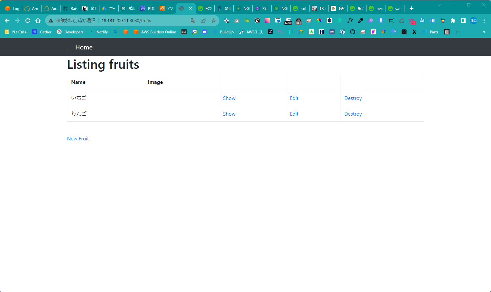
## Nginxの表示
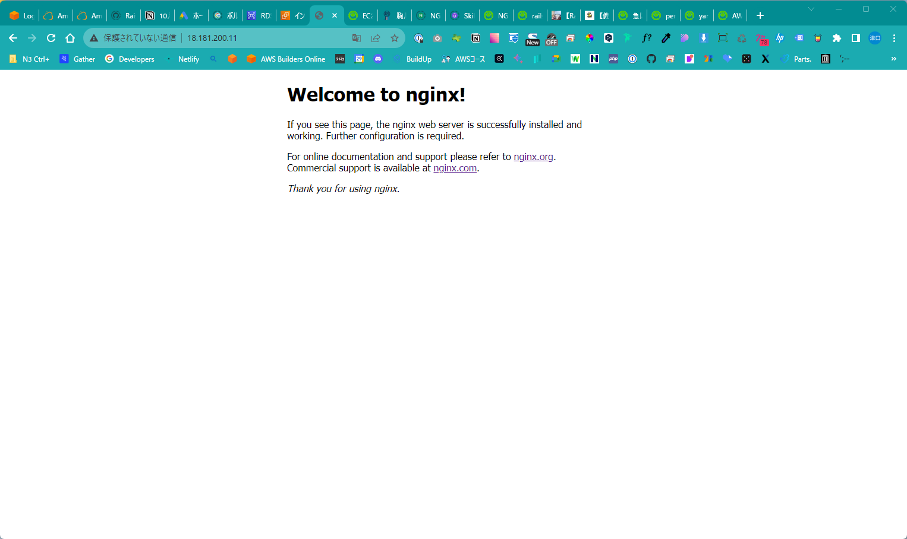
## unicornをNginxで表示
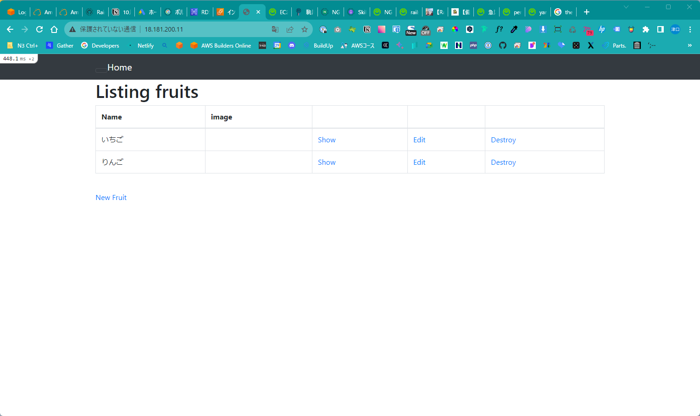
## NLBを追加して、ロードバランサーでの表示
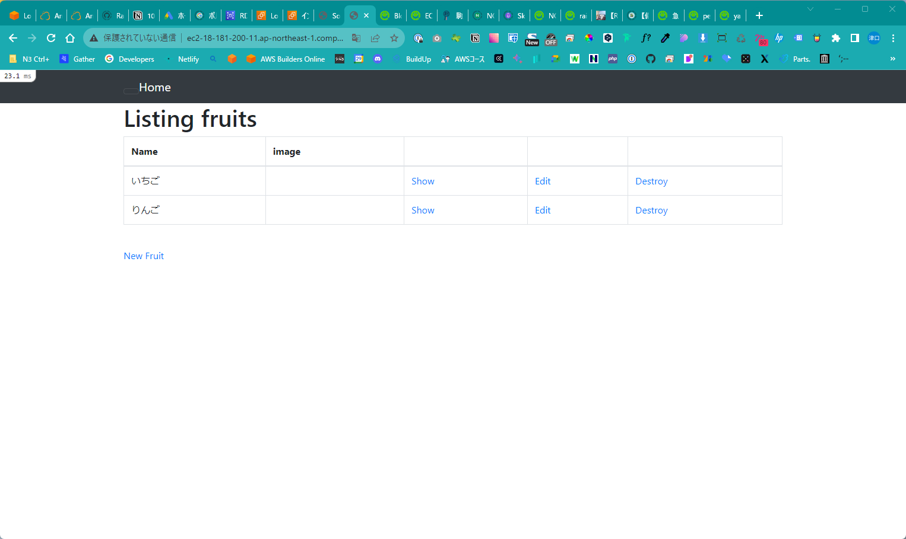
## S3の追加
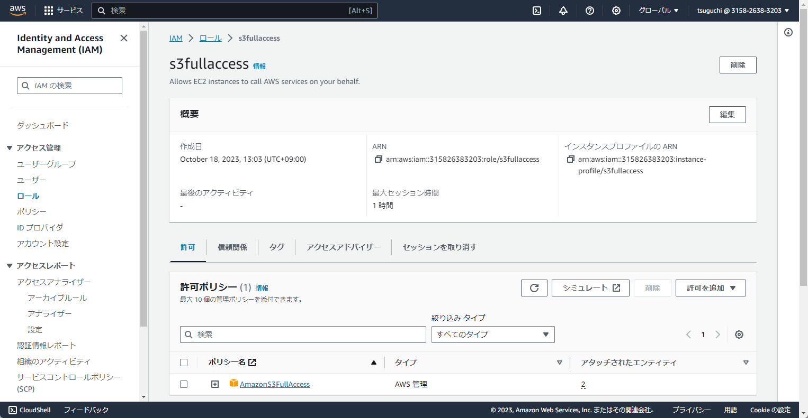
## 構成図
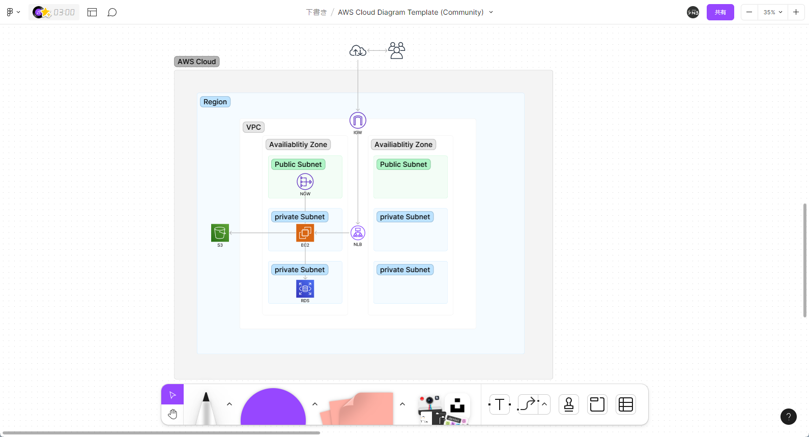
## ALBを追加して、ロードバランサーで表示
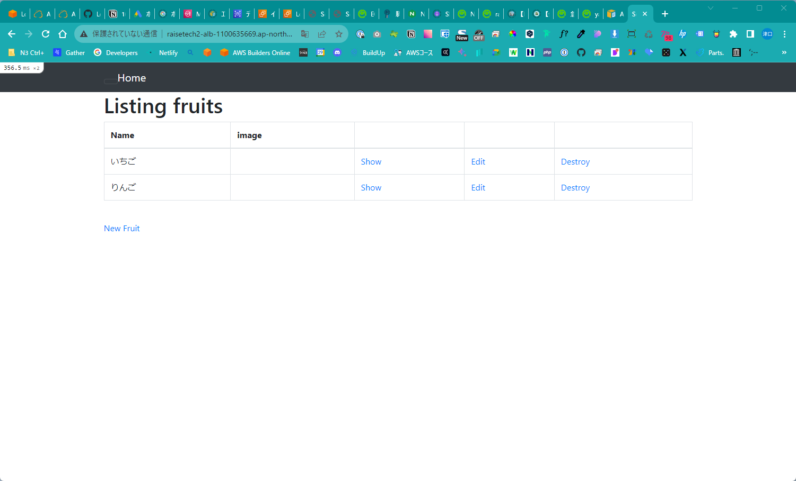
## S3へ画像をアップロード
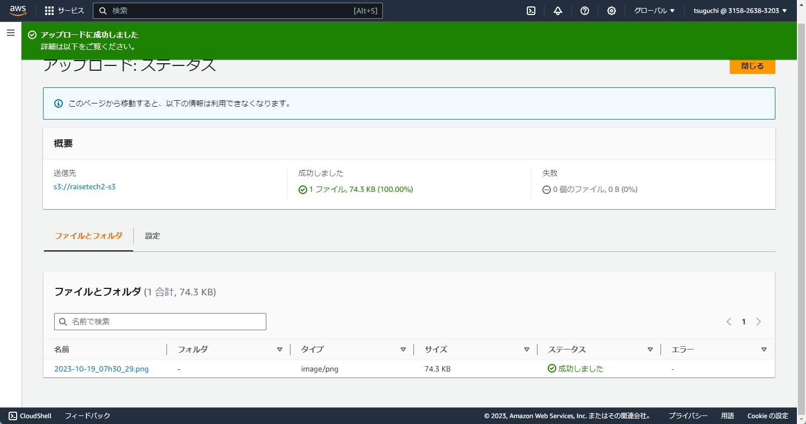
## 構成図書き直し
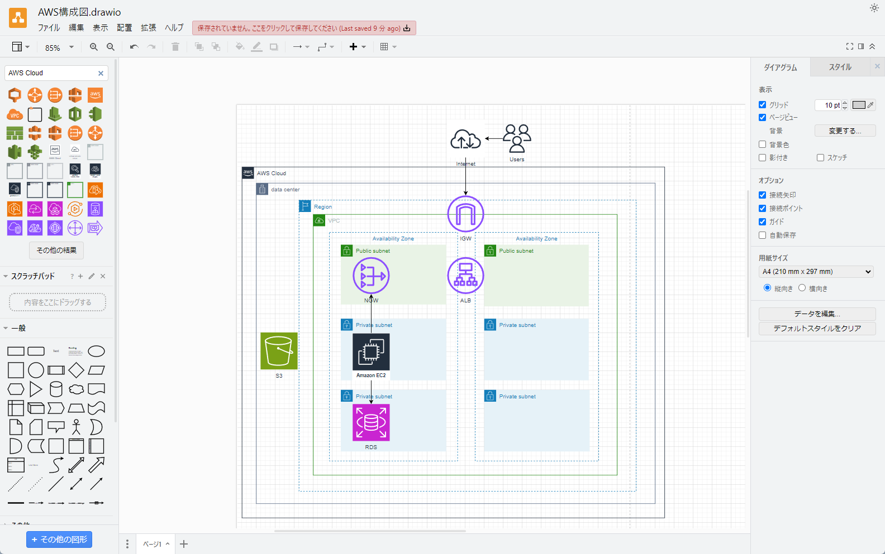
## ALBでロードバランサーを再表示
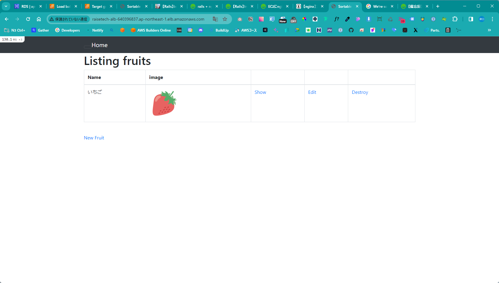
## S3の画像追加再提出スクリーンショット
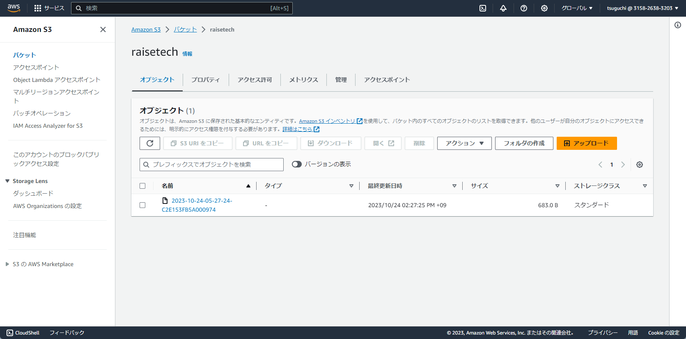
## ALBのロードバランサーの設定表示
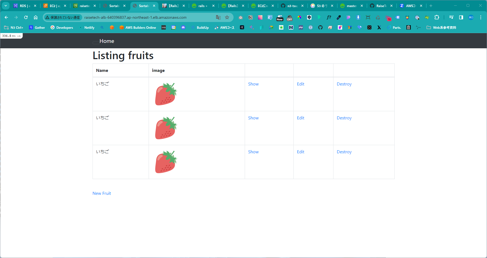
## ALBロードバランサーのコンソール画面
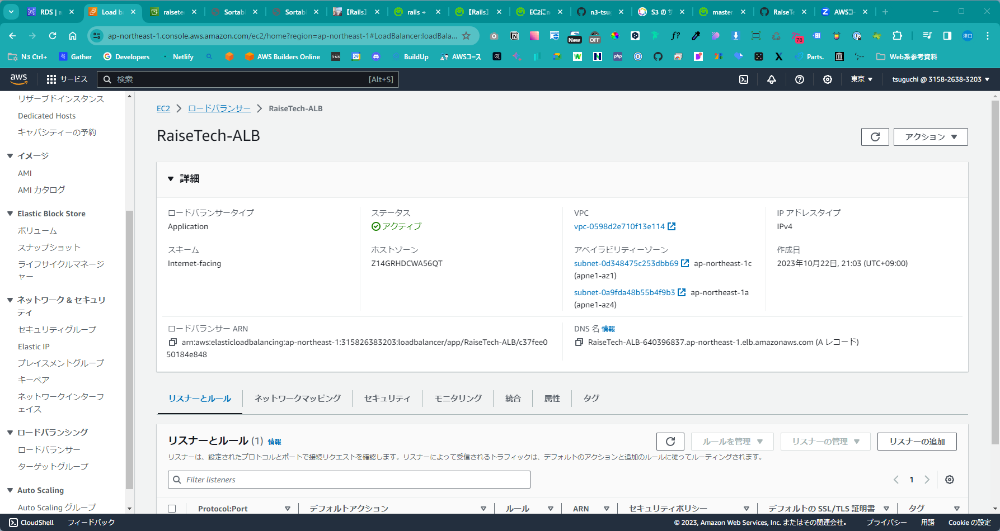
### 今回の課題から学んだこと
- １０回くらいサーバーを構築しました。
- 常にエラーとの戦いでした。
- 環境構築にエラーはつきものと思いました。
- エラーメッセージをGoogle検索する重要性を理解しました。
- ChatGPTは使う場面を限定しないと、的を得た回答が返ってこないと思いました。
- 今回は4週間かかりましたね・・・。
