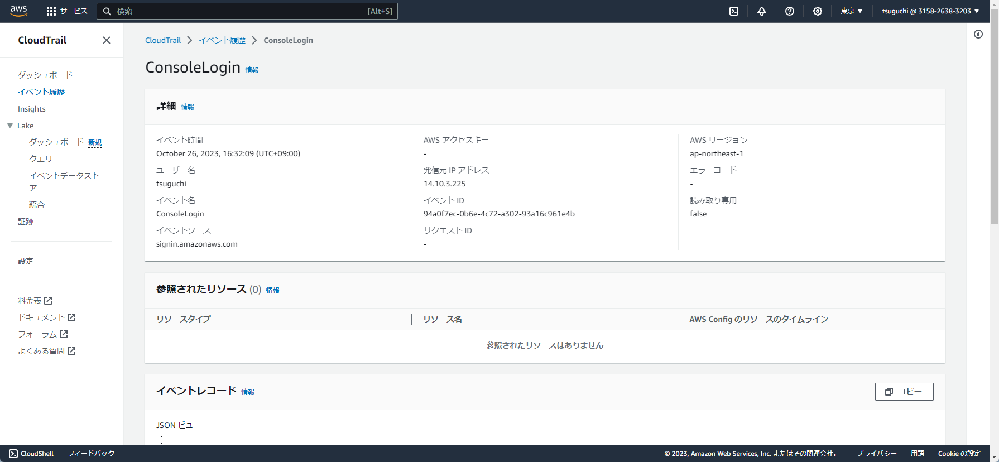
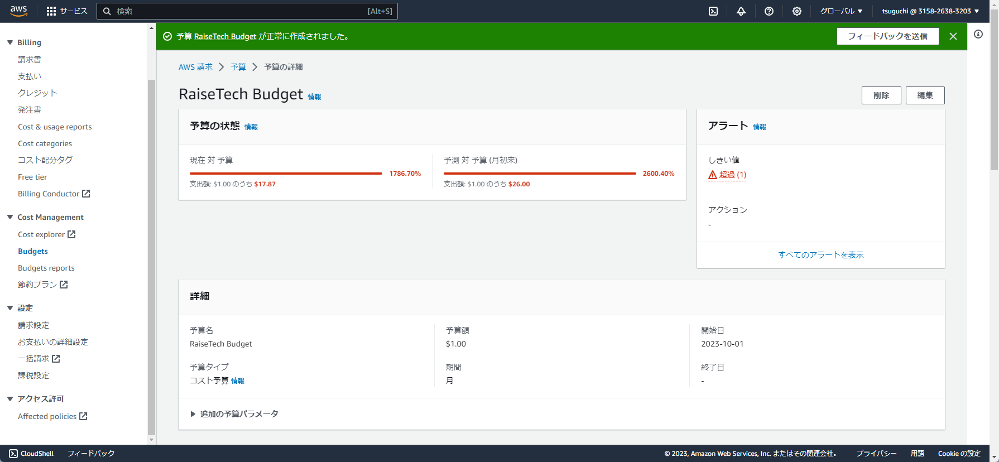
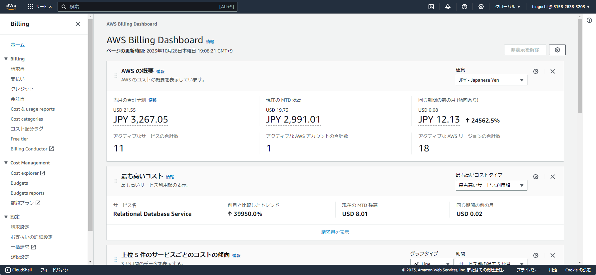
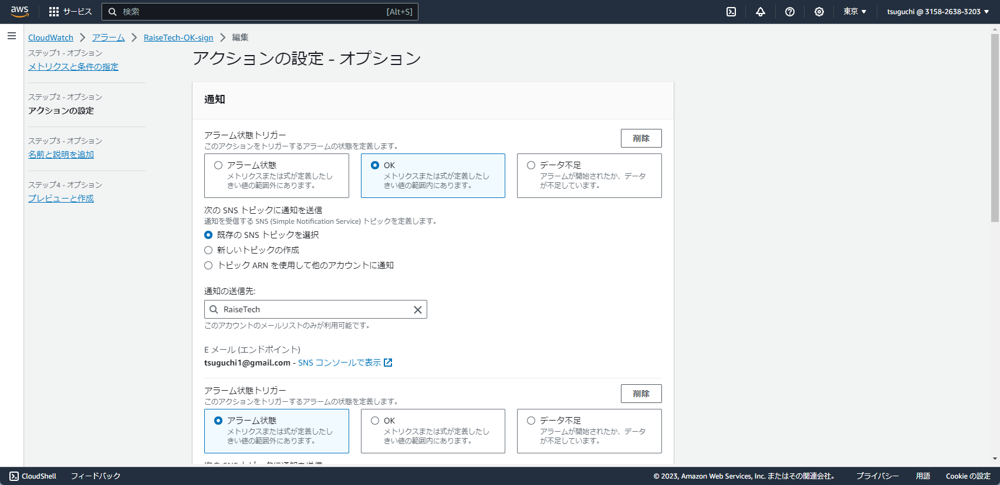

# RaiseTech
## 第６回課題演習
## CloudTrailからイベント名と含まれている内容の３つをピックアップ

## AWS利用料の見積もり

## マネジメントコンソールの現在の利用料

## CloudWatchの設定内容について

### 今回の感想
- 第６回課題演習はそんなに難しくない印象です。
- 第５回課題演習で主にEC2の削除と再構築をやりまくって、AWSの請求金額が６０００円くらいまでいってしまいました・・・。
