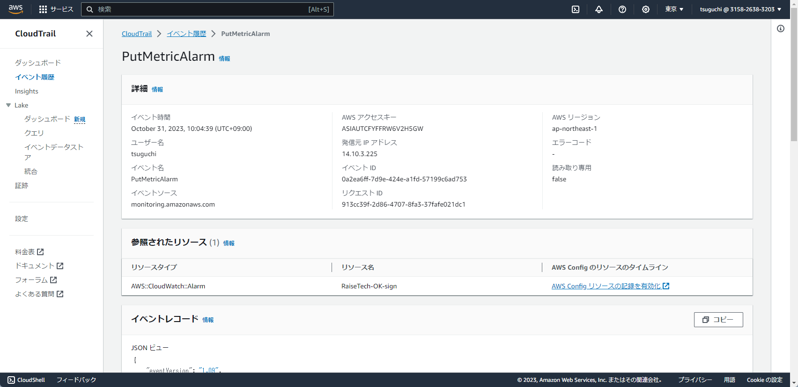
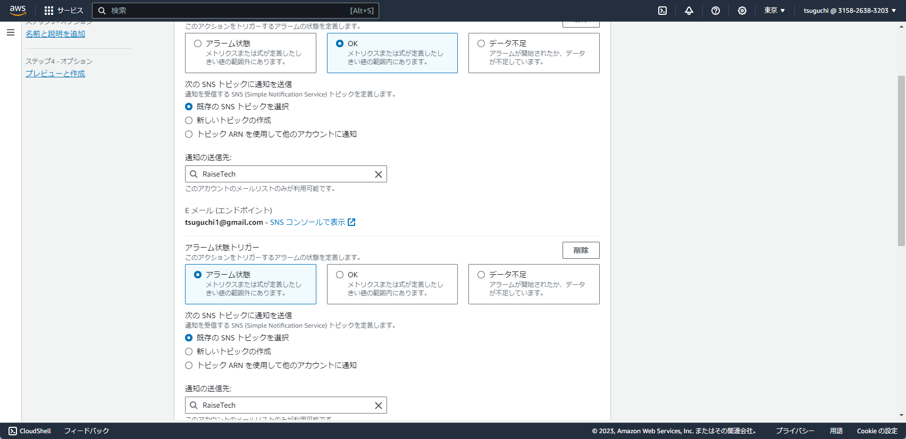
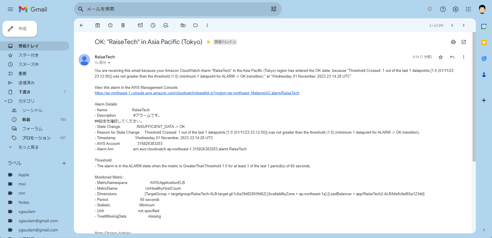
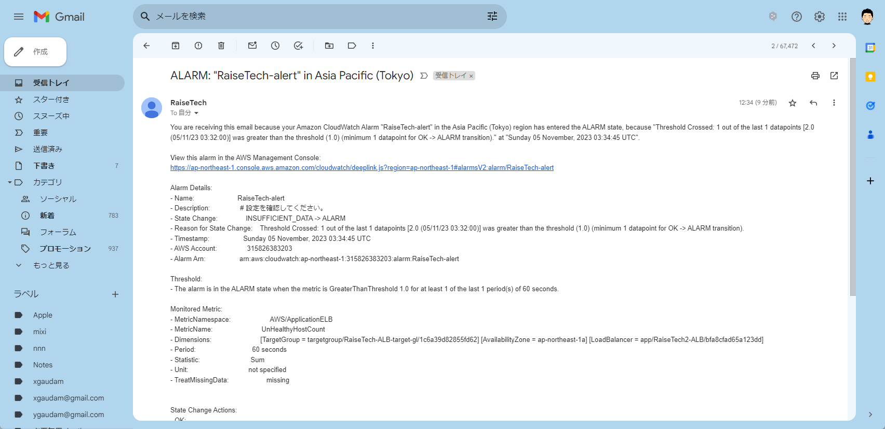
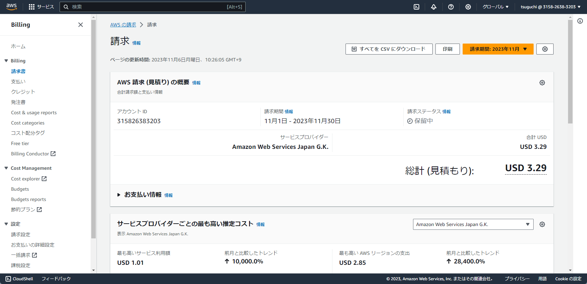

# RaiseTech
## 第６回課題演習
## CloudTrailからイベント名と含まれている内容の３つをピックアップ
## イベント名　PutMetricAlarm　以下イベント内容の３つ
- イベントソース　
- AWS アクセスキー
- 発信元 IP アドレス

## AWS利用料の見積もり

## マネジメントコンソールの現在の利用料

## CloudWatchの設定内容について

## アラームからの通知

## アラームからの警告

## AWSの見積もりの追加画像

### 今回の感想
- 第６回課題演習はそんなに難しくない印象です。
- 第５回課題演習で主にEC2の削除と再構築をやりまくって、AWSの請求金額が消費税込みで７６００円くらいまでいってしまいました・・・。
- EC2とRDSの構築、削除は料金にかからないとコメントありましたので、今月など料金を確認していこうと思います。
