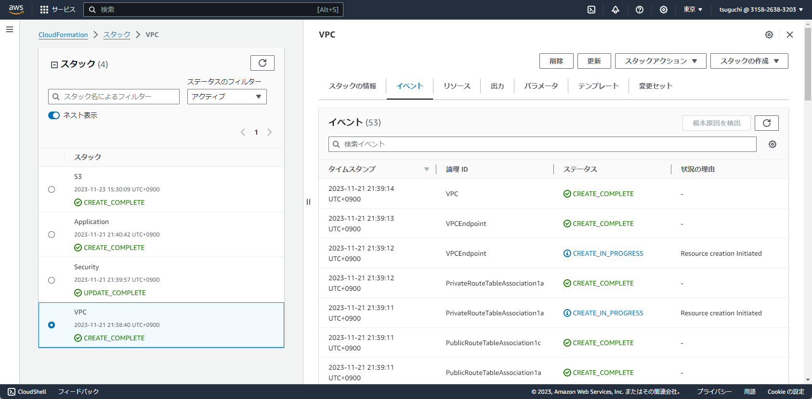
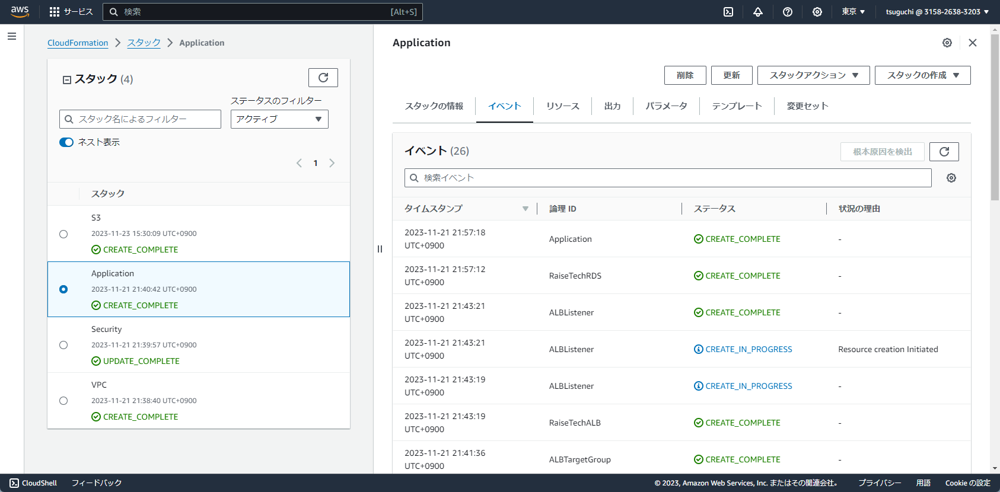
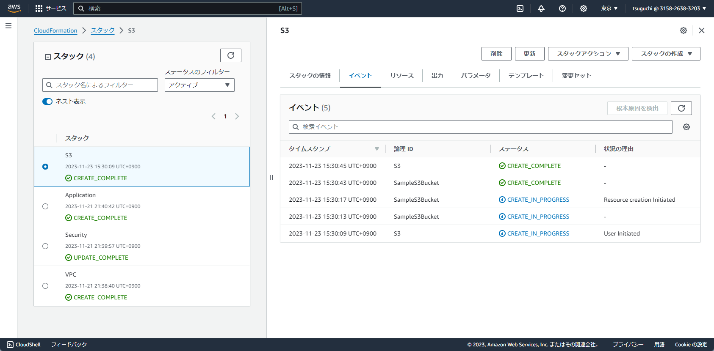
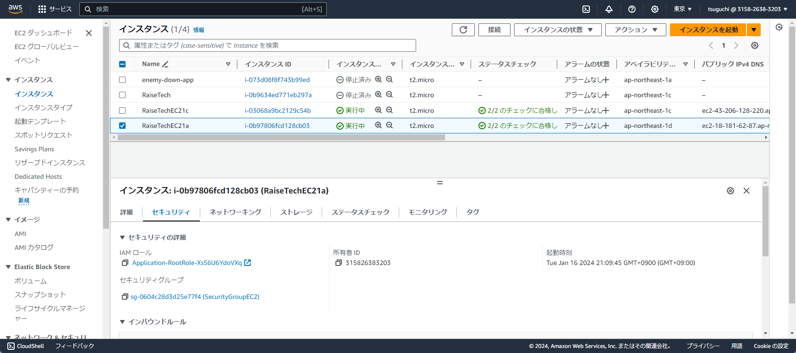
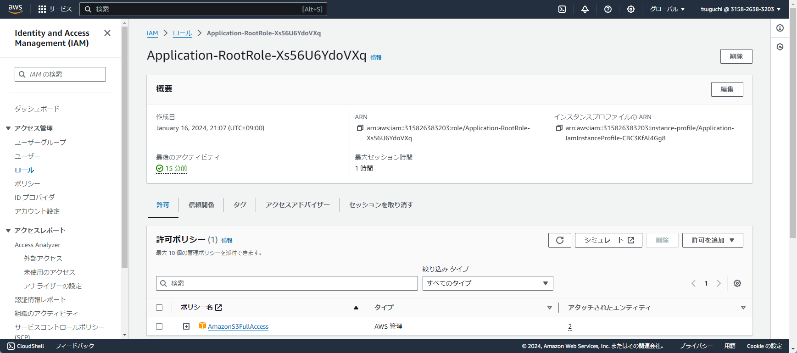
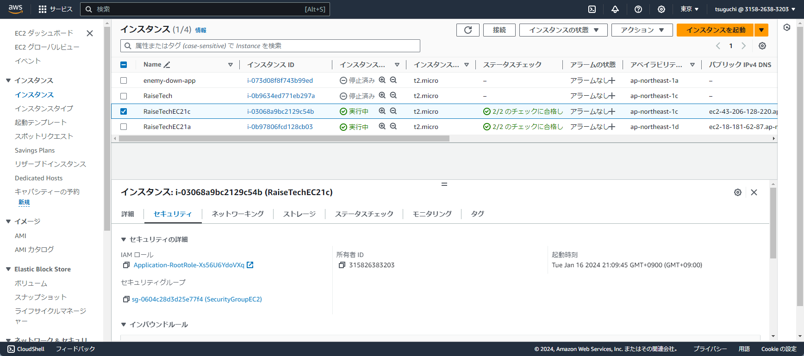
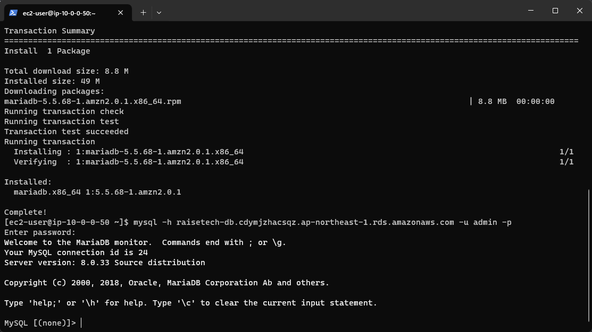

# 第１０回課題演習
## CloudFormationの自動構築のエビデンス

## EC2からRDSへの接続確認

### 今回の自動構築のCloudformationについて
- 同じコードで自動構築しているはずがVPCのサブネットの構築の結果が違うなどありました。
- テンプレートをカスタマイズしていたので、論理IDなどトライ＆エラーで覚えていきました。
- アベイラビリティゾーンを論理IDに設定すると使いまわしがきかないなど学習しました。
- コードでインフラ自動構築はまだまだ勉強しないといけないと思いました。
- Teraformなども覚えていきたいです。
